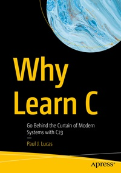

# Apress Source Code

This repository accompanies [*Why Learn C*](https://link.springer.com/book/9798868815966) by Paul J. Lucas (Apress, 2025).

[comment]: #cover

Download the files as a zip using the green button, or clone the repository to your machine using Git.

## Releases

Release v1.0 corresponds to the code in the published book, without corrections or updates.

## Installation

Many of the C examples are compiled
and some are tested
to ensure they're syntactically
and semantically
correct.
A C compiler capable of compiling C23
via the `-std=c23` option is required.

The git repository contains only the necessary source code.
Things like `configure` are _derived_ sources and
[should not be included in repositories](http://stackoverflow.com/a/18732931).
If you have
[`autoconf`](https://www.gnu.org/software/autoconf/),
[`automake`](https://www.gnu.org/software/automake/),
and
[`m4`](https://www.gnu.org/software/m4/)
installed,
you can generate `configure` yourself by doing:

    ./bootstrap

After that:

    ./configure

If you need to use a compiler
other than the first `gcc`
found in the `PATH` environment variable,
specify it via `CC`, e.g.:

    ./configure CC=clang

Finally,
to build
the source code
for the larger examples:

    make

If you get linker errors
like "undefined reference to `__atomic_load`",
add `LDFLAGS=-latomic`
to your `configure` command.

Optionally,
you can also run unit tests
for the larger examples:

    make check

## Contributions

See the file
[`Contributing.md`](https://github.com/Apress/Why-Learn-C/blob/main/Contributing.md)
for more information
on how you can contribute
to this repository.
